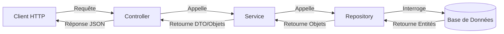

# Structure et Architecture du Projet Cinemax (Backend)

Ce document détaille l'architecture du backend de l'application Cinemax, qui est une API REST construite avec Spring Boot.

## 1. Structure des Dossiers

L'application suit une architecture en couches classique de Spring Boot. Voici l'organisation des dossiers dans `src/main/java/cinemax` :

### `config`
Contient les classes de configuration de l'application.
- **`WebConfig.java`** : Configure les ressources web, notamment la gestion des fichiers uploadés (images, etc.) en les rendant accessibles via une URL.

### `controller`
C'est la couche d'entrée de l'API (REST Controllers). Ces classes gèrent les requêtes HTTP (GET, POST, PUT, DELETE) et renvoient des réponses JSON.
- **`MovieController.java`** : Gestion des films (récupération, création, mise à jour, suppression).
- **`UserController.java`** : Gestion des utilisateurs et de l'authentification (login).
- **`ReservationController.java`** : Gestion des réservations de séances.
- **`CommentController.java`** : Gestion des commentaires sur les films.
- **`ContactMessageController.java`** : Gestion des messages de contact.
- **`FileUploadController.java`** : Gestion de l'upload de fichiers (affiches de films, avatars).

### `service`
Contient la logique métier de l'application. Les contrôleurs appellent les services, qui à leur tour appellent les repositories.
- **`MovieService.java`** : Logique pour les films.
- **`UserService.java`** : Logique pour les utilisateurs (y compris la vérification du mot de passe).
- **`ReservationService.java`** : Logique pour les réservations.
- **`CommentService.java`** : Logique pour les commentaires.
- **`ContactMessageService.java`** : Logique pour les messages.

### `repository`
C'est la couche d'accès aux données (DAO). Ces interfaces étendent `JpaRepository` et permettent d'interagir avec la base de données MySQL sans écrire de SQL manuellement.
- **`MovieRepository.java`**
- **`UserRepository.java`**
- **`ReservationRepository.java`**
- **`CommentRepository.java`**
- **`ContactMessageRepository.java`**

### `model`
Contient les entités JPA qui représentent les tables de la base de données.
- **`Movie.java`** : Représente un film (titre, description, durée, etc.).
- **`User.java`** : Représente un utilisateur (nom, email, mot de passe, rôle).
- **`Reservation.java`** : Représente une réservation liée à un utilisateur et une séance/film.
- **`Comment.java`** : Représente un commentaire laissé par un utilisateur sur un film.
- **`ContactMessage.java`** : Représente un message envoyé via le formulaire de contact.

---

## 2. Relations entre les Objets

L'architecture repose sur l'injection de dépendances de Spring.

1.  **Le Client (Frontend/Postman)** envoie une requête HTTP (ex: `GET /api/movies`).
2.  **Le Controller** (`MovieController`) reçoit la requête.
3.  **Le Controller** appelle le **Service** (`MovieService`).
4.  **Le Service** exécute la logique métier et appelle le **Repository** (`MovieRepository`).
5.  **Le Repository** interroge la base de données et retourne des objets **Model** (`Movie`).
6.  Les données remontent la chaîne et sont renvoyées au client sous format JSON.

### Diagramme de flux simplifié :

## 3. Fichiers Importants à la Racine

- **`pom.xml`** : Fichier de configuration Maven. Il liste toutes les dépendances du projet (Spring Boot Web, Data JPA, MySQL Driver, Lombok, etc.).
- **`src/main/resources/application.properties`** : Configuration de l'application (connexion à la base de données MySQL, port du serveur, configuration JPA).
- **`CinemaxApplication.java`** : La classe principale qui contient la méthode `main` pour lancer l'application Spring Boot.
